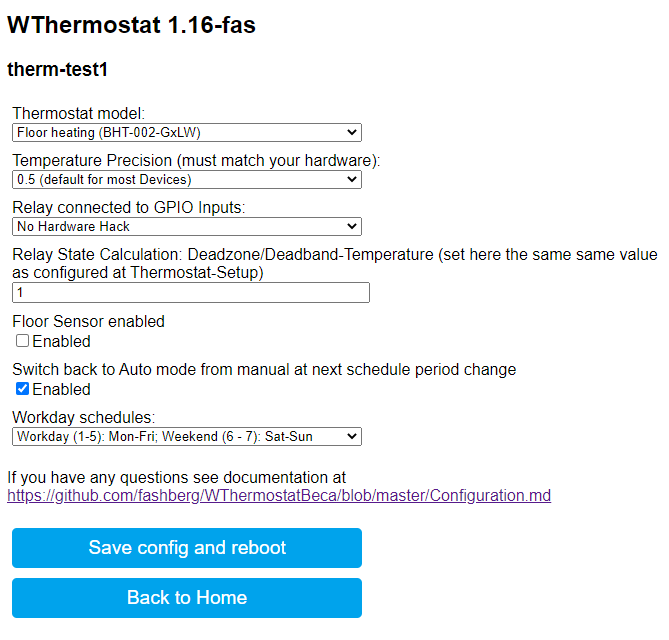

# Configuration of Thermostat

This document describes the first configuration steps after flashing of firmware. The firmware supports MQTT messaging and
Mozilla Webthings. Both can be running parallel.

Steps are in general:

1. Connect to the WiFi Access Point of the Thermostat
2. Connect to Thermostat GUI and Configure Network access
3. Configure MQTT (optional)
4. Connect to Thermostat GUI again in your network
5. Configure thermostat device (model selection)
6. Configure clock settings

## 1. Connect to the WiFi Access Point of the Thermostat

* The thermostat becomes an Access Point when it's started first time after flashing with no configuration.
* The AccessPoint is named `Thermostat-xxxxxx`. Default password is `12345678`
* Use your Smartphone or any other WiFi Client with web browser and connect to the Thermostat.
* You'll get an IP Address by DHCP in Range 192.168.4.0/24

## 2. Connect to Thermostat GUI and Configure Network access

* After you are connected to the Thermostat's WiFi open `http://192.168.4.1` in a web browser
  * On Android Smartphones this Page opens automatically as a captive portal
* Go to 'Configure Network'
* Fill out 'Hostname/Idx' (unique id of your choice), 'WiFi SSID' (only 2.4G, Name is case sensitive), 'Password' for WiFi
* If you don't want to use MQTT, press 'Save Configuration' and wait for reboot of device.

  

## 2. Configure MQTT (optional) and HASS Autodiscovery

* Stay at page 'Network configuration'
* Select checkbox 'Support MQTT', web page will extend
* Fill out 'MQTT Server', 'MQTT User' (optional), 'MQTT password' (optional) and 'MQTT topic'
* If you are using Home Assistant then check "Support Autodiscovery for Home Assistant using MQTT".
* For some other Smart Home Server (e.g. OpenHAB) optionally check "Send all values also as single values via MQTT" (then you don't have to parse JSON-Strings from summarized output).
* Press 'Save Configuration' and wait for reboot of device.

## 4. Connect to Thermostat GUI again in your network

* After you have pressed "Save configuration" the thermostat reboots and tries to connect to the configured network
* Now you have to find out the IP-Address of the device.
  * Try to open `http://<hostname>.<domainname>/` - if your router (DHCP+DNS) supports it. The Hostname is what you have configured before
  * Alternative: Connect to your router and check for the thermostat in Hostlist or check your DHCP-Server leases table
  * Alternative: After restart, the thermostat sends MQTT messages to topics 'devices/thermostat', 'devices/clock' and 'devices/logging' to let you know the IP and MQTT topic of the device. The json messages are looking like:

```json
{
  "url":"http://xxx.xxx.xxx.xxx/things/thermostat",
  "ip":"xxx.xxx.xxx.xxx",
  "topic":"<your_topic>/[cmnd|stat|tele]/things/thermostat"
}
```

* Open the webpage of the thermostat in your favorite browser `http://<device_ip>/`

## 3. Configure thermostat device

* Go to 'Configure device'
* Choose your thermostat **model**
* Choose, if heating or cooling **relay monitor hardware hack** should be enabled. Hardware modification necessary to work, see <https://github.com/klausahrenberg/WThermostatBeca/issues/17#issuecomment-552078026>
* **Relay State Calculation**: The WiFi-Module does not know without the Hardware Hack if the Realy is Opened or Closed.
   But we can calculate the state, based on the measured temperature.
   Set this paramter to the same Deadzone/Deadband-Temperature value which is confired at thermostat settings (BHT-002: Option Code 2, BAC-002: Option Code C). Value is between 1 and 5 degree Celsius, factory default is 1.
   Does not apply if state of Relay is configured to Hardware-Hack.
setting to calculate the state of the Heating Relay
* Choose if **floor sensor** values should be reported (enable if you have floor sensor connected and are running in 'AL'-Mode). See also next section
* Choose if the thermostat should **switch back from manual heating mode** to schedule mode at the next scheduled period change
* Choose **workday and weekend** start in your region
* Press 'Save Configuration' and wait for reboot of device.

  

### External Temperature Sensor

You can connect one external NTC temperature sensor (type 10K, 3950) to BHT-002 thermostats, for GB-Model it's included.
In settings menu of MCU (option 4) you can switch between internal (IN), external (OU) and All (AL). See [BHT-002-Manual.pdf](./docs/BHT-002-Manual-long.pdf).

* IN-Mode: MCU reports only temperature of internal sensor and uses it for thermostat room-temperature. Value "floorTemperature" shows 0.00, or last measured value of OU- or AL-Mode (even after restart or re-powering).
* OU-Mode: MCU reports only temperature of external sensor and uses it for thermostat room-temperature. WThermostat Values "temperature" and "floorTemperature" are the same (external sensor).
* AL-Mode: MCU reports both temperatures, uses internal sensor for room-temperature and external sensor for maximum floor temperature overheating protection. Values "temperature" and "floorTemperature" are both valid with its measured values.
  * It's not possible to change MCU behavior to other modes, e.g. using external temperature sensor to control relays and only display value of internal sensor is not possible.
  * See [Issue #27](https://github.com/fashberg/WThermostatBeca/issues/27) with Workaround by @IanAdd with Home Assistant controlled Heating/Idle state depending on floorTemperature
  * Hint: Long pressing the rightest button for 5 seconds (while device switched on) the displays shows external temperature.

## 4. Configure clock settings

* Go to 'Configure clock'
* Modify 'NTP server' for time synchronization
* Modify 'Time zone' for time offset synchronisation depending on your location
  * Set Timezone to values -13:30 .. 13:30 for fixed timezone
  * Set Timezone to 99 for Daylight Saving
  * DST/STD: W,M,D,h,T
  W = week (0 = last week of month, 1..4 = first .. fourth)
  M = month (1..12)
  D = day of week (1..7 1 = sunday 7 = saturday)
  h = hour (0..23)
  T = timezone (-810..810) (offset from UTC in MINUTES - 810min / 60min=13:30)
  * It's adopted from <https://tasmota.github.io/docs/Commands/#timestd> - but you don't need the Hemisphere Setting (first number), its calculated
* Examples:

  | Region | Timezone | DST | STD | Explanation |
  | ---------- | ---------- | ----- | ----- | ---- |
  | UTC | 0 |  |  | Just UTC
  | Pacific/Honolulu | 10 |  |  | Fixed 10 Hours Offset, no Daylight saving
  | Asia/Beijing | -8 |  | |  Fixed -8 hours Offset
  | Europe/Berlin | 99 |  0,3,0,2,120 | 0,10,0,3,60 | DST from last Sunday in March at 2 o'clock with 2h Offset from UTC and ends at last sunday in October at 3 o clock with 1 hour offset during standard time
  | Europe/London | 99 |  0,3,0,2,60 | 0,10,0,3,0 | DST from last Sunday in March at 2 o'clock with 1h Offset from UTC and ends at last sunday in October at 3 o clock with no offset during standard time
  | America/New_York | 99 | 2,3,0,2,-240 | 1,11,0,2,-300 | DST from 2nd Sunday in March at 2 o'clock with -4h Offset from UTC and ends at first sunday in November at 3 o clock with -5h offset during standard time
  | Australia/Sydney | 99 | 1,10,1,2,660 | 1,4,1,3,600 | DST from first Sunday in October at 2 o'clock with 11h Offset from UTC and ends at first sunday in April at 3 o clock with 10h offset during standard time

## 5. Troubleshooting

### Logging

If anything went wrong set MQTT-Logging to "trace" and monitor with MQTT-Client:

```sh
mosquitto_sub  -h  <mqttserver> -v -t "<MQTT-TOPIC>/tele/log/#"
```

### Network Recovery

If you cannot access your device, try to switch to Access-Point mode:

* Power off the device by Pressing the button in the middle.
* Then press the "down" button (most right) for about 8 seconds.
* The Screen starts to blink and shows a WiFi-Icon.
* The thermostat is now an Access Point named `Thermostat-xxxxxx`. Default password is `12345678`
* Now you can fix network settings.
* Saving settings or pressing power button switches back to Station mode
