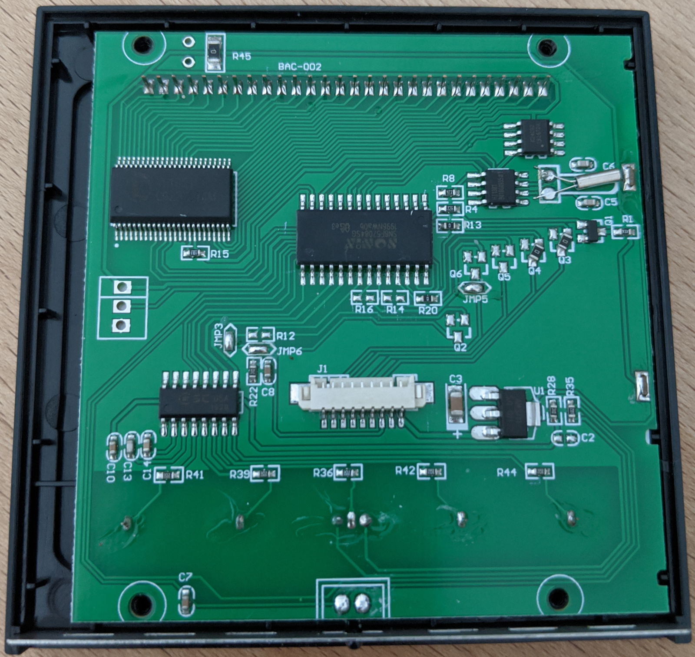

## Notice
Modifying and flashing of devices is at your own risk. I'm not responsible for bricked or damaged devices. I strongly recommend a backup of original firmware before installing any other software.  
The thermostat is working independent from the Wifi-Module. That means, functionality of the thermostat itself will not and can't be changed. This firmware replaces only the communication part of the thermostat, which is handled by the ESP module. The firmware will partially work with other devices too. The Tuya devices has a serial communication standard (MCU commands) which is only different in parameters. Unknown commands will be forwarded to the MQTT server.

## Choose your way
There are 2 options to flash the firmware on device:
1. Use tuya-convert for flashing. Tested multiple times with success on all devices!
2. Flashing device manually: Unplug and open the device, wire 4 cables and connect it to a programmer for ESP8266 
3. Uploading WThermostat if you already have installed tasmota or another Free Firmware

## Download pre-built binaries

Pre-Built binaries can be downloaded at <a href="https://github.com/fashberg/WThermostatBeca/releases">releases-page</a>.

# Option 1: Use tuya-convert
This method does not require any kind of soldering or disassembly of the device.
You should be able to flash Beca Thermostats (BHT-002 and BHT-6000 also) with [tuya-convert](https://github.com/ct-Open-Source/tuya-convert).  
Follow the steps [here](https://github.com/ct-Open-Source/tuya-convert#procedure) to upload the firmware to your thermostat.  
Download the wthermostat-1.xx-fas.bin binary from https://github.com/fashberg/WThermostatBeca/releases and place it in the ```/files/``` folder before starting the flash procedure. 

Video of this procedure: https://youtu.be/fqfghJqnK_8

## Restore original Firmware: ##
The Backup file dumped by tuya-convert is 1 MB large (whole flash of ESP-Chip), which is too big to be flashed OTA (over the air). So you are not able to flash back to original Firmware without soldering!
See: https://github.com/ct-Open-Source/tuya-convert/issues/113 

# Option 2: Flashing device manually
## 1. Check your device
Compatible devices looks inside like this. On the top left you can see the ESP8266 module (TYWE3S)


The following picture shows an BHT-002GA with __NO WIFI__ - no chance to flash or to enhance.



## 2. Connection to device for flashing
There are many ways to get the physical connection to ESP module. I soldered the connections on the device for flashing. Maybe there is a more elegant way to do that. It's quite the same, if you try to flash any other Sonoff devices to Tasmota. So get the inspiration for flashing there: https://github.com/arendst/Sonoff-Tasmota/wiki

Following connections were working for me (refer to ESP-12E pinout):
- Red: ESP-VCC and ESP-EN (Enable) connected to Programmer-VCC (3.3V) 
- Black: ESP-GND and ESP-GPIO15 connected to Programmer-GND
- Green: ESP-RX connected to Programmer-TX
- Yellow: ESP-TX connected to Programmer-RX
- Blue right: ESP-GPIO0, must be connected with GND during power up
- Blue left: ESP-Reset, connect to GND to restart the ESP


I've tested flashing with both this TTL-Adapters and had success:
* DSD TECH SH-U09C2 with FT232RL
  * https://www.amazon.de/gp/product/B07TXVRQ7V/
  * 10 EUR Amazon Prime (Germany)
  * Has separate Voltage regulator on Board which delivers enough power
  * You can jumper betweeen 1.8/3.3/5 Volt (it switches Vcc AND Signal-Level - which is important)
  * Not sure if it's original FTDI-Chip (has not the 2014 'bug', but text seems to be printed not laser-engraved), but overall quality looks very good, including RX/TX LEDs
* AliExpress Cheap Adaptter with Profilic PL2303
  * https://www.aliexpress.com/item/32893637666.html
  * 3 EUR and long delivery time
  * Vcc Pin can easily soldered from 5V to 3.3V (has to be changed to 3.3V)
  * Signal Level is always 3.3 Volt (measured with Osci)
  * No separate Voltage Regulator, but flashing was ok

Good to know:
* If not entering programming-mode (GPIO-0 not connected to GND) the ESP boots normally and is reachable through WiFi.
* Between the read_flash, erase_flash and write_flash commands you have to reset the ESP!
  * By repowering
  * Or by connecting RESET-PIN to GND for a short time
  * GPIO-0 has to be connected to GND during these reboots to enter flashing mode
* If flashing does not work:
  * was GPIO-0 connected to GND while power-up
  * Does your TTL-Adapter deliveres enough power to power ESP?
  * Is ESP-EN (Enabled) connected to Vcc?

Another Image with DSD TECH SH-U09C2 adapter:


## 3. Remove the main power supply from thermostat during all flashing steps
Flashing will fail if the thermostat is still powered up during this operation.
Connect only the 3.3 Volt from RS232/TTL-Adapter.

## 4. Backup the original firmware
Don't skip this. In case of malfunction you need the original firmware. Tasmota has also a great tutorial for the right esptool commands: https://github.com/arendst/Sonoff-Tasmota/wiki/Esptool. So the backup command is:

```esptool.py -p <yourCOMport> -b 460800 read_flash 0x00000 0x100000 originalFirmware1M.bin```

for example:

```esptool.py -p /dev/ttyUSB0 -b 460800 read_flash 0x00000 0x100000 originalFirmware1M.bin```

Example running Windows with PlatformIO's integrated python interpreter:
```
PS C:\> python C:\Users\folke\.platformio\packages\tool-esptoolpy\esptool.py -p COM6 -b 460800 read_flash 0x00000 0x100000 bac002-originalFirmware1M.bin
esptool.py v2.8
Serial port COM6
Connecting....
Detecting chip type... ESP8266
Chip is ESP8266EX
Features: WiFi
Crystal is 26MHz
MAC: 84:f3:eb:e7:b0:87
Uploading stub...
Running stub...
Stub running...
Changing baud rate to 460800
Changed.
1048576 (100 %)
1048576 (100 %)
Read 1048576 bytes at 0x0 in 25.3 seconds (331.8 kbit/s)...
Hard resetting via RTS pin...
```

## 5. Upload new firmware
Get the ESP in programming mode first.
Erase flash:

```esptool.py -p /dev/ttyUSB0 erase_flash```

After erasing the flash, get the ESP in programming mode again. 
Write firmware (1MB)

```esptool.py -p /dev/ttyUSB0 write_flash -fs 1MB 0x0 WThermostat_x.xx.bin```

```
PS C:\> python C:\Users\folke\.platformio\packages\tool-esptoolpy\esptool.py -p COM6 erase_flash
esptool.py v2.8
Serial port COM6
Connecting....
Detecting chip type... ESP8266
Chip is ESP8266EX
Features: WiFi
Crystal is 26MHz
MAC: 84:f3:eb:e7:b0:87
Uploading stub...
Running stub...
Stub running...
Erasing flash (this may take a while)...
Chip erase completed successfully in 2.0s
Hard resetting via RTS pin...


PS C:\> python C:\Users\folke\.platformio\packages\tool-esptoolpy\esptool.py -p COM6 write_flash -fs 1MB 0x0 .\build_output\firmware\wthermostat-1.15-fas.bin
esptool.py v2.8
Serial port COM6
Connecting........__
Detecting chip type... ESP8266
Chip is ESP8266EX
Features: WiFi
Crystal is 26MHz
MAC: 84:f3:eb:e7:b0:87
Uploading stub...
Running stub...
Stub running...
Configuring flash size...
Compressed 387808 bytes to 270181...
Wrote 387808 bytes (270181 compressed) at 0x00000000 in 25.2 seconds (effective 123.0 kbit/s)...
Hash of data verified.

Leaving...
Hard resetting via RTS pin...
```

# Option 3: Flashing on top of Tasmota or other Free Firmware
If you already have tasmota installed or any other free ESP alternative you can upgrade easyly using the "Firmware Upgrade" function.
If you get "Upload Failed - Not compatible" you have to set the following option in tasmota console before you start the upgrade:
```SetOption78 1```

All tasmota settings will get lost, also the network configuration!
If you run Klaus Ahrenbergs WThermostat >= 1.09 then network settings will be kept on Firmware Upgrade.

# After the Upgrade
If you have installed WThermostat you have to configure it - see <a href="Configuration.md">Configuration.md</a>
