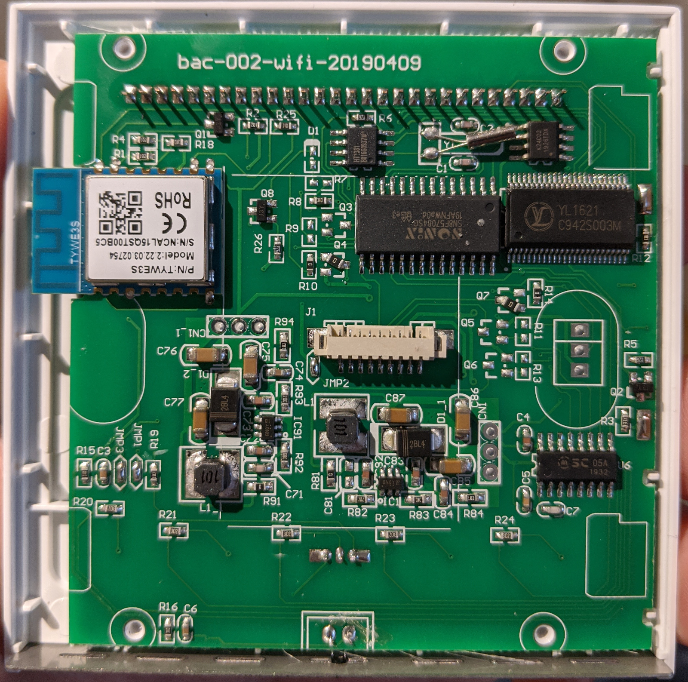
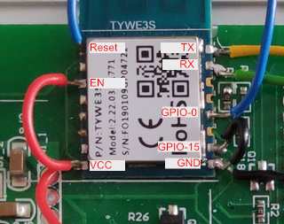
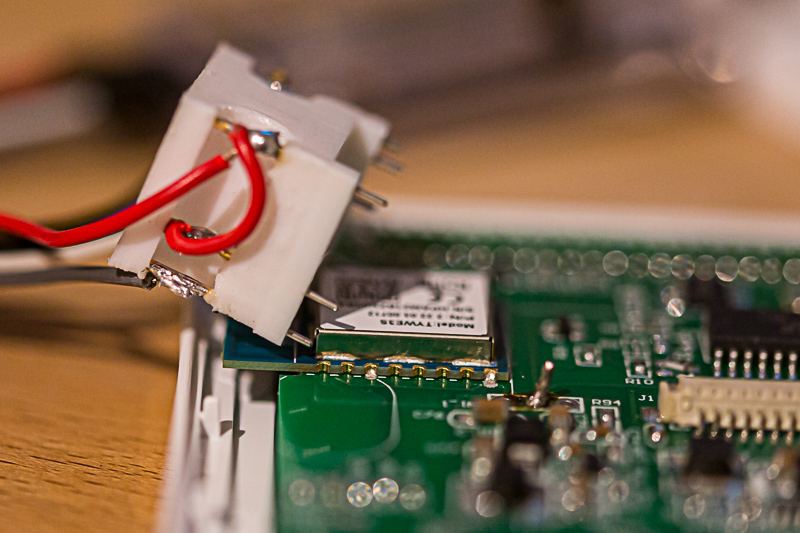
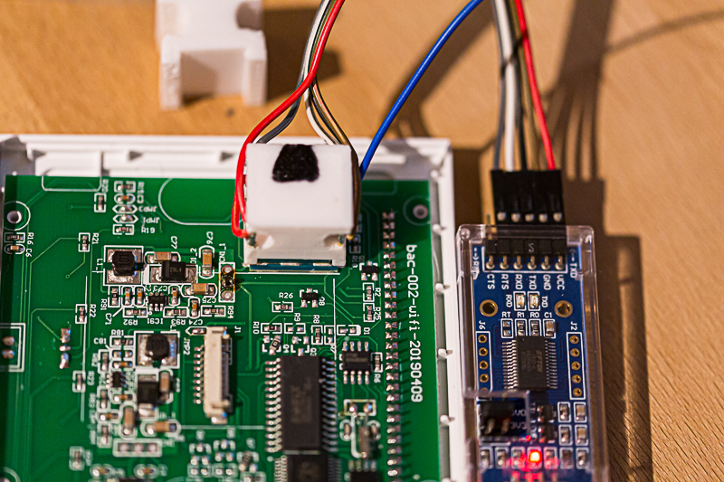
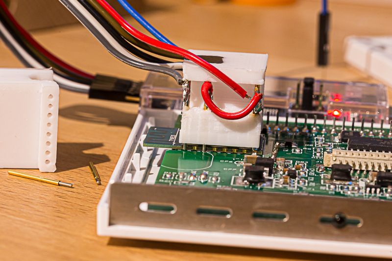
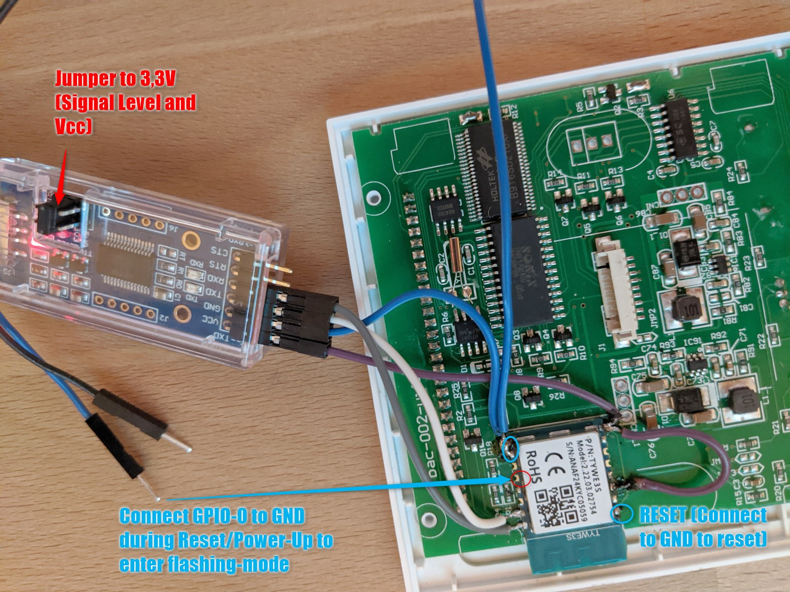

# Flashing Thermostat Guide

## Notice

Modifying and flashing of devices is at your own risk. I'm not responsible for bricked or damaged devices. I strongly recommend a backup of original firmware before installing any other software.  
The thermostat is working independent from the WiFi-Module. That means, functionality of the thermostat itself will not and can't be changed. This firmware replaces only the communication part of the thermostat, which is handled by the ESP module. The firmware will partially work with other devices too. The Tuya devices has a serial communication standard (MCU commands) which is only different in parameters. Unknown commands will be forwarded to the MQTT server.

## Choose your way

There are 2 options to flash the firmware on device:

1. Use tuya-convert for flashing. Tested multiple times with success on all devices!
2. Flashing device manually: Unplug and open the device, wire 4 cables and connect it to a programmer for ESP8266
3. Uploading WThermostat if you already have installed tasmota or another Free Firmware

## Download pre-built binaries

Pre-Built binaries can be downloaded at [releases-page](https://github.com/fashberg/WThermostatBeca/releases).

## Option 1: Use tuya-convert

---

### NOTE

:warning: **Nearly all devices are now shipped with a new Firmware which cannot be upgraded Over The Air with non-tuya-servers.**
 In this case you have to use Option 2 (opening and then soldering or using the pogo-adapter).

If you start tuya-convert procedure and the WiFi Icon on the device starts blinking very fast while talking to your tuya-convert, then it seems you have to new Firmware. You will see no error in the console, but you will get this messages in your logfile:

#### Logfile: tuya-convert/scripts/smarthack-psk.log

```log
could not establish sslpsk socket: [SSL: DECRYPTION_FAILED_OR_BAD_RECORD_MAC] de
cryption failed or bad record mac (_ssl.c:1056)
```

Links Regarting new Tuya-Firmware:

- <https://github.com/ct-Open-Source/tuya-convert/wiki/Collaboration-document-for-PSK-Identity-02>
- <https://github.com/klausahrenberg/WThermostatBeca/issues/114#issuecomment-691165619>

---

### Tuya Convert - only for devices with old Tuya-Firmware

This method does not require any kind of soldering or disassembly of the device.
You should be able to flash (maybe only older) Beca Thermostats (BHT-002 and BHT-6000 also) with [tuya-convert](https://github.com/ct-Open-Source/tuya-convert).

You need Linux and a supported WiFi-Device which can be set to WiFi-Access-Point-Mode to run tuya-convert. Also Ubuntu running from USB stick works fine, or using a Raspberry works also great, but you need LAN, a 2nd WiFi or a Local-HDMI-Console to access the RasPi (because WiFi is used exclusively by tuya-convert).

Steps to flash device running pre 2020 tuya-firmware using tuya-convert:

1. Prepare Tuya-Convert, see <https://github.com/ct-Open-Source/tuya-convert#procedure>

2. Download the wthermostat-1.xx-fas.bin binary from <https://github.com/fashberg/WThermostatBeca/releases> and place it in the ```/files/``` folder before starting the flash procedure.

3. Connect device to 230 Volt

4. Press Power Off Button (middle button)

5. Press and Hold most right key until WiFi Icon starts to blink

6. Device is now in tuya-update mode - start now ``sudo ./start_flash.sh``

Video of this procedure: <https://youtu.be/fqfghJqnK_8>

### Restore original Firmware

The Backup file dumped by tuya-convert is 1 MB large (whole flash of ESP-Chip), which is too big to be flashed OTA (over the air). You are not able to flash back to original Firmware without direct serial connection!
See: <https://github.com/ct-Open-Source/tuya-convert/issues/113>

## Option 2: Flashing device manually

Important Information:

- No Main Power!
  
  Remove Mains while Flashing

- Enough 3.3 Volt Power

  Flashing requires lot of power. Some USB-to-TTL adapters do not deliver enough Power to keep voltage at 3.3 V. Check out some Adapters i have tested below

- MCU to WiFi-Module (TYWE3S) communication during flashing

  Probably MCU is sending traffic to WiFi-Module during flashing which brakes communication.
  Check this thread <https://github.com/fashberg/WThermostatBeca/issues/115>

### 2.1. Check your device

Compatible devices look inside like this. On the top left you can see the ESP8266 module (TYWE3S)



The following picture shows an BHT-002GA with _NO WIFI__ - no chance to flash or to enhance.
See my detailed diagnosis on this at [Diagnose Can we add WiFi to Non-WiFi Thermostat bac-002.pdf](./docs/Diagnose%20Can%20we%20add%20WiFi%20to%20Non-Wifi%20Thermostat%20bac-002.pdf), this document also show a little bit about communication between MCU und ESP.


### 2.2. Connection to device for flashing

There are many ways to get the physical connection to ESP module. It's quite the same, if you try to flash any other Sonoff devices to Tasmota. Get the inspiration for flashing there: <https://tasmota.github.io/docs/Getting-Started/>

Following connections were working for me (refer to ESP-12E pinout):

- Red: ESP-VCC and ESP-EN (Enable) connected to Programmer-VCC (3.3V)
- Black: ESP-GND and ESP-GPIO15 connected to Programmer-GND
- Green: ESP-RX connected to Programmer-TX
- Yellow: ESP-TX connected to Programmer-RX
- Blue right: ESP-GPIO0, must be connected with GND during power up to set device into programming mode
- Blue left: ESP-Reset, connect to GND to restart the ESP or connect to Programmer-RTS, Programmer can reset then automatically.



#### Self made ESP Pogo Adapter

Direct connection without soldering?

That is possible using a self-printed Pogo Adapter. There are some ready to use products called "IC Test Clip" from 3M and other manufactures, but they are all only for 2,54 mm/0.1 inch chips. ESP8266 has 2mm raster. I could not find anything suitable for ESP Chips.

Then I have found this one DIY-Version: <https://www.thingiverse.com/thing:4547369>

Here are some pictures flashing with my self-3d-printed ESP-Pogo-Adapter:







Accessories I have used:

- PINS with Spring <https://www.amazon.de/gp/product/B0147W4DEA>
- Clamp to Fix Adapter (no really necessary, but better): <https://www.amazon.de/gp/product/B0001P19O0>
- 1mm drill to widen the holes: (my print was not accurate enough for 1mm holes) <https://www.amazon.de/gp/product/B06XG1FY8P>

#### Right Serial Adapter

I've tested flashing with both this TTL-Adapters and had success:

- DSD TECH SH-U09C2 with FT232RL
  - <https://www.amazon.de/gp/product/B07TXVRQ7V/>
  - 10 EUR Amazon Prime (Germany)
  - Has separate Voltage regulator on Board which delivers enough power
  - You can jumper betweeen 1.8/3.3/5 Volt (it switches Vcc AND Signal-Level - which is important)
  - Not sure if it is an original FTDI-Chip (has not the 2014 'bug', but text seems to be printed and not laser-engraved), but overall quality looks very good
  - RX/TX LEDs
  - RTS-PIN for software-controlled reset of ESP
- AliExpress Cheap Adapter with CH340
  - <https://aliexpress.com/item/32761423124.html>
  - less than 1 EUR and long delivery time
  - Vcc Pin be jumpered from 5V to 3.3V (must be changed to 3.3V)
- AliExpress Cheap Adapter with Profilic PL2303
  - <https://www.aliexpress.com/item/32893637666.html>
  - 3 EUR and long delivery time
  - Vcc Pin can easily soldered from 5V to 3.3V (must be changed to 3.3V)
  - Signal Level is always 3.3 Volt (measured with Osci)
  - No separate Voltage Regulator, but flashing was ok

#### Good to know

- If not entering programming-mode (GPIO-0 not connected to GND) the ESP boots normally and is reachable through WiFi.
- Between the read_flash, erase_flash and write_flash commands you must reset the ESP!
  - By repowering
  - Or by connecting RESET-PIN to GND for a short time
  - GPIO-0 must be connected to GND during these reboots to enter flashing mode
- If flashing does not work:
  - was GPIO-0 connected to GND while power-up
  - Does your TTL-Adapter delivers enough power to power ESP?
  - Is ESP-EN (Enabled) connected to Vcc?

Another Image with DSD TECH SH-U09C2 adapter:


### 2.3. Remove the main power supply from thermostat during all flashing steps

Flashing will fail if the thermostat is still powered up during this operation.
Connect only the 3.3 Volt from RS232/TTL-Adapter!

### 2.4. Backup the original firmware

Don't skip this. In case of malfunction you need the original firmware. Tasmota has also a great tutorial for the right esptool commands: <https://github.com/arendst/Sonoff-Tasmota/wiki/Esptool>. So the backup command is:

```esptool.py -p <yourCOMport> -b 460800 read_flash 0x00000 0x100000 originalFirmware1M.bin```

for example:

```esptool.py -p /dev/ttyUSB0 -b 460800 read_flash 0x00000 0x100000 originalFirmware1M.bin```

Example running Windows with PlatformIO's integrated python interpreter:

```sh
PS C:\> python C:\Users\folke\.platformio\packages\tool-esptoolpy\esptool.py -p COM6 -b 460800 read_flash 0x00000 0x100000 bac002-originalFirmware1M.bin
esptool.py v2.8
Serial port COM6
Connecting....
Detecting chip type... ESP8266
Chip is ESP8266EX
Features: WiFi
Crystal is 26MHz
MAC: 84:f3:eb:e7:b0:87
Uploading stub...
Running stub...
Stub running...
Changing baud rate to 460800
Changed.
1048576 (100 %)
1048576 (100 %)
Read 1048576 bytes at 0x0 in 25.3 seconds (331.8 kbit/s)...
Hard resetting via RTS pin...
```

### 2.5. Upload new firmware

Get the ESP in programming mode first.
Erase flash:

```esptool.py -p /dev/ttyUSB0 erase_flash```

After erasing the flash, get the ESP in programming mode again.
Write firmware (1MB)

```esptool.py -p /dev/ttyUSB0 write_flash -fs 1MB 0x0 WThermostat_x.xx.bin```

```sh
PS C:\> python C:\Users\folke\.platformio\packages\tool-esptoolpy\esptool.py -p COM6 erase_flash
esptool.py v2.8
Serial port COM6
Connecting....
Detecting chip type... ESP8266
Chip is ESP8266EX
Features: WiFi
Crystal is 26MHz
MAC: 84:f3:eb:e7:b0:87
Uploading stub...
Running stub...
Stub running...
Erasing flash (this may take a while)...
Chip erase completed successfully in 2.0s
Hard resetting via RTS pin...


PS C:\> python C:\Users\folke\.platformio\packages\tool-esptoolpy\esptool.py -p COM6 write_flash -fs 1MB 0x0 .\build_output\firmware\wthermostat-1.15-fas.bin
esptool.py v2.8
Serial port COM6
Connecting........__
Detecting chip type... ESP8266
Chip is ESP8266EX
Features: WiFi
Crystal is 26MHz
MAC: 84:f3:eb:e7:b0:87
Uploading stub...
Running stub...
Stub running...
Configuring flash size...
Compressed 387808 bytes to 270181...
Wrote 387808 bytes (270181 compressed) at 0x00000000 in 25.2 seconds (effective 123.0 kbit/s)...
Hash of data verified.

Leaving...
Hard resetting via RTS pin...
```

## Option 3: Flashing on top of Tasmota or other Free Firmware

If you already have tasmota installed or any other free ESP alternative you can upgrade easily using the "Firmware Upgrade" function.
If you get "Upload Failed - Not compatible" you have to set the following option in tasmota console before you start the upgrade:
```SetOption78 1```

All tasmota settings, including network configuration, will get lost! The Thermostat becomes an AP and you just have to reconfigure as described in [Configuration.md](Configuration.md).

If you upgrade from Klaus Ahrenbergs WThermostat all network settings will be kept on Firmware Upgrade, but not thermostat-settings.

### Not Enough Space

If you get 'Not Enough Space' while Upgrading you can flash a lite-version called ``wthermostat-minimal-1.xx-fas.bin`` - then do WiFi-Configuration of Thermostat and after this flash the full-version.

### Back to tasmota

Unhappy? On top of WThermostat you can directly flash ``tasmota.bin`` or ``tasmota.bin.gz`` or probably any other ESP firmware.

Hint: Do *not* flash ``tasmota-minimal.bin`` to WThermostat! If you do so you will not be able to access ore reconfigure the device. Use instead ``tasmota-lite.bin`` if space is getting too small.

## After the Upgrade

If you have installed WThermostat you have to configure it - see [Configuration.md](Configuration.md).
