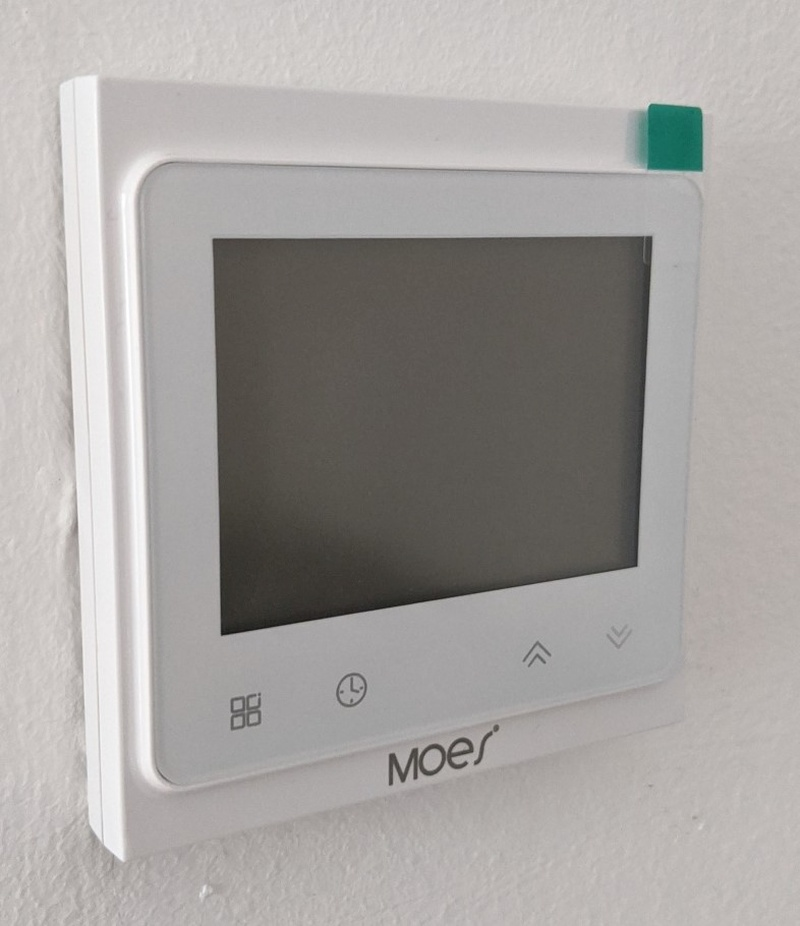

# Installation
Here a quick overview of installing the Beca/Moes thermostat.

## ATTENTION
This devices are running at 115/230 Volt AC - which is highly dangerous.

YOU CAN BE ELECTROCUTED IF YOU DON'T KNOW WHAT YOU ARE DOING!

Ask a professional to install the devices if you are unsure how to do or if local law or your insurance forbids you to do such works!
The author of this guide is not responsilbe for any damages.

## 1. Switch Main Power Power off

Switch Main Power off.
Check if main power is off.
Ensure no one switches if on.

## 2. Check and remove old Thermostat
Open old thermostat.  Check function of inputs and outputs and notice the wiring.
  

## 2. Remove Display-Unit
You better should remove Processor-Wifi-Unit from Relais-Body before you'are going to install.
The surface is very sensitive for scratches.
  

## 3. Wiring
The Images shows the GA-Version which has two relais:
1 - Relais/Output 1 (Close) is active if powered on and the the room temperature is warm enough so the valve should close
2 - Relais/Output 2 (Open) is active if powered on and the the room temperature is to cold so the valve should open to heat the room

Often you only need Output 2 (Open) and Input 3 (N) and 4 (L)
 

## 4. Screw the plate to the wall

  

## 5. Connect to Display-Unit
Also you can remove the surface protection (pull green label).
  

Now you can switch Main Power on.

Then you can flash this version of WThermostatBeca - see <a href="Flashing.md">Flashing.md</a>
Then you are ready for configuration - see <a href="Configuration.md">Configuration.md</a>

