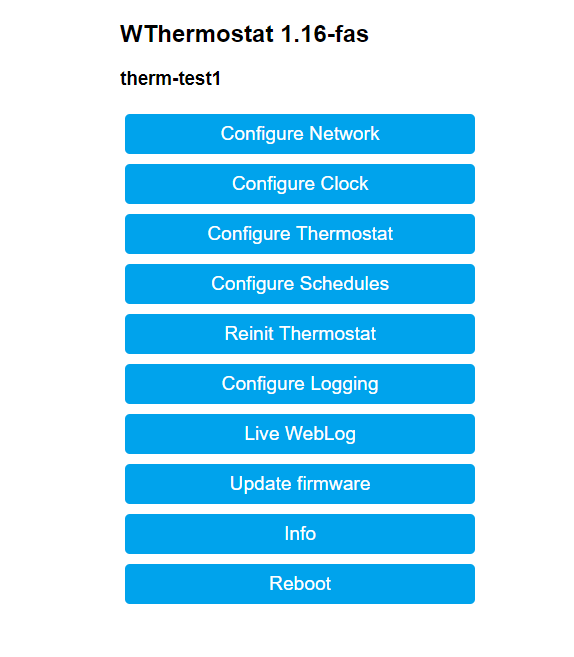
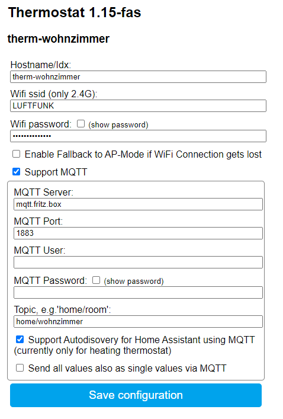
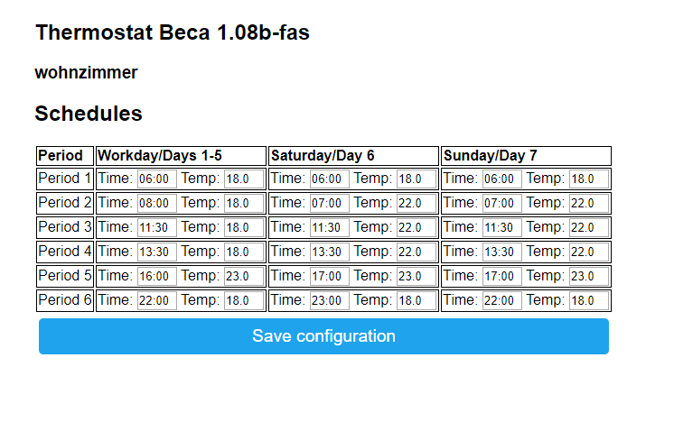
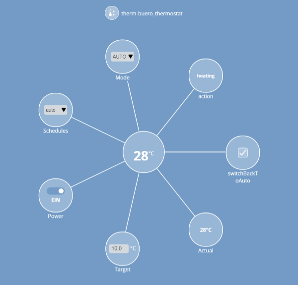
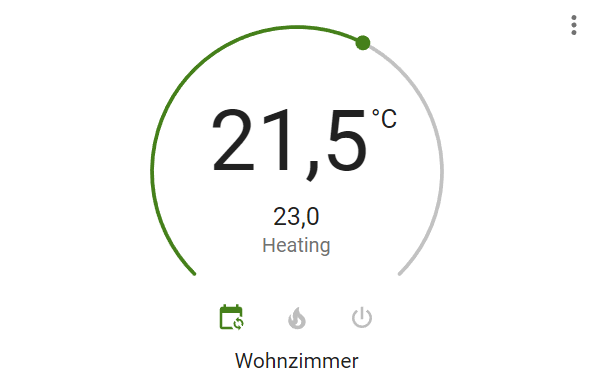

# WThermostat - FAS-Fork

[](https://github.com/fashberg/WThermostatBeca/releases/latest)
[](https://github.com/fashberg/WThermostatBeca/releases)
[](https://github.com/fashberg/WThermostatBeca/releases/latest)
[](https://gitpod.io/#https://github.com/fashberg/WThermostatBeca)
[](https://travis-ci.org/github/fashberg/WThermostatBeca)

Fork of <https://github.com/klausahrenberg/WThermostatBeca> with some new features.

Replaces original Tuya firmware on Beca thermostat with ESP8266 wifi module.

## Supported Devices

The firmware has been tested or reported to work with following devices:

* BHT-002 WiFi Thermostat
  * BHT-002-GALW (Water/Gas heating)
  * BHT-002-GBLW (floor heating)
  * BHT-002-GCLW (Water/Gas Boiler)
* BHT-6000 WiFi Thermostat
  * BHT-6000-GALW, BHT-6000-GBLW, BHT-6000-GCLW
* BHT-3000 WiFi Thermostat
  * BHT-3000-GALW, BHT-3000-GBLW, BHT-3000-GCLW
  * also known as BTH-3000L-ABLW, BTH-3000L-GBLW, BTH-3000L-GCLW
* BAC-1000-ALW WiFi Thermostat for Conditioning (heating, cooling, ventilation)
  * also known as BAC-002-ALW

Also selled by Moes or Qiumi.


## Features

* No Cloud dependencies!
* Enables thermostat to communicate via MQTT and/or Mozilla WebThings
* Autodiscovery for Home Assistant via MQTT _(fas)_
* Autodiscovery for WebThings via mDNS
* Configuration of connection, device parameters and schedules via web interface
* Provides NTP, time zone handling and Daylight-Saving-Calculation _(fas)_ to set the clock of thermostat
* Provides Fallback to Access Point mode if requested using panel-buttons _(fas)_
* Reading and setting of all parameters via MQTT
* Reading and setting of main parameters via WebThings
* Only BHT-002-GxLW: actualFloorTemperature (external temperature sensor)
* Only BAC-002-ALW: fanSpeed:auto|low|medium|high; systemMode:cooling|heating|ventilation
* Reading and setting of time schedules via MQTT
* Reading and setting of Schedules via Web-GUI
* Automatic switching back to temperature-scheduling from manual mode next schedule interval (optional)
* Logging to MQTT _(fas)_

_(fas)_: Only available in -fas version

## Hardware-Versions

You need the WiFi Version! (W in productname suffix, like -GAL**W**). There is also a version without WLAN. See [Diagnose Can we add WiFi to Non-Wifi Thermostat bac-002.pdf](./docs/Diagnose%20Can%20we%20add%20WiFi%20to%20Non-Wifi%20Thermostat%20bac-002.pdf)

The BHT Version is for heating only. The BAC-Version has modes Cooling, Heating and Ventilation.
The BHT-002-GA/GB/GC versions only differs in relays-wiring.

### Difference between GA, GB and GC

* GA - Water-Heating
  * Two Relays for opening and closing valve
  * Only one Relay will be closed at the same time
  * Closing Relay PIN 1 - PIN 3 (N or L)
  * Opening Relay PIN 2 - PIN 3 (N or L)
  * Product Spec says Max Power: 3 A
* GB - Electric-Heating
  * Connect Heating between PIN 1 and PIN 2
  * Product Spec says Max Power: 16 A
* GC - Water/Gas Boiler
  * One Relay - potential free (dry contact)
  * Relay on PIN 1 - PIN 2 (dry contacts)
  * Product Spec says Max Power: 3 A

### External Temperature Sensor

You can connect one external NTC temperature sensor (type 10K, 3950) to BHT-002 thermostats, for GB-Model it's included.
In settings menu of MCU (option 4) you can switch between internal (IN), external (OU) and All (AL). See [BHT-002-Manual.pdf](./docs/BHT-002-Manual-long.pdf).

* IN-Mode: MCU reports only temperature of internal sensor and uses it for thermostat room-temperature. Value "floorTemperature" shows 0.00, or last measured value of OU- or AL-Mode (even after restart or re-powering).
* OU-Mode: MCU reports only temperature of external sensor and uses it for thermostat room-temperature. WThermostat Values "temperature" and "floorTemperature" are the same (external sensor).
* AL-Mode: MCU reports both temperatures, uses internal sensor for room-temperature and external sensor for maximum floor temperature overheating protection. Values "temperature" and "floorTemperature" are both valid.
  * It's not possible to change MCU behavior to other modes, e.g. using external temperature sensor to control relays and only display value of internal sensor is not possible.
  * See [Issue #27](https://github.com/fashberg/WThermostatBeca/issues/27) with Workaround by @IanAdd with Home Assistant controlled Heating/Idle state depending on floorTemperature
  * Hint: Long pressing the most right button for 5 seconds (while device switched on) the displays shows external temperature.

### Hardware Installation

Here a description of how to install the hardware - indepentent from Open Source WThermostat.
**No special Hardware installation neccessary for Upgrading to this firmware!**

* see [Installation.md](Installation.md)

## Download binaries

Pre-built binaries can be downloaded at [releases-page](https://github.com/fashberg/WThermostatBeca/releases).

## Software Installation

You can install the firmware either

* by using tuya-convert - no Hardware Modifications necessary
* by soldering cables to the ESP-Modules using an ESP/Arduino-Programmer (3,3 Volt TTL)
* by using OTA Upgrade on tasmota or other OpenSource ESP Firmware

Yoube video of converting to 1.14-fas with tuya-convert: <https://youtu.be/fqfghJqnK_8>

Follow instructions here: [Flashing.md](Flashing.md)

## Initial configuration

* The devices becomes an Access Point
* Connect to WiFi `Thermostat-xxxxxx` with Password `12345678`
* Open `http://192.168.4.1` or wait for Captive Portal to be opened on Android
* Configure your WiFi Settings
* After initial setup, the device configuration is available at `http://<device_ip>/`
* Configure device model, clock and other settings

See [Configuration.md](Configuration.md) for a detailed explanation of the setup.

## Upgrading

You can Upgrade over the Air from other versions of WThermostatBeca on the Web-GUI.
Please check all settings after Upgrade!

If you upgrade from original Klaus-Ahrenberg's Original-Version please note:

* Only WLAN settings are kept
* If you get "Not Enough Space" you can use WThermostat_1.xx-fas-minial.bin as interim-version.
  * WLAN settings are kept
  * no MQTT, no Beca-control, no Clock in -minimal
  * Then Upgrade to normal-version
  * Not neccessary when upgrading from fas to fas versions

## Screenshots

Main Screen:

  

Network Screen:

  

Schedule Screen:

  

## Integration in WebThings

Since version 0.96 this firmware supports Mozilla WebThings directly. With webthings you can control the thermostat via the Gateway - inside and also outside of your home network. No clunky VPN, dynDNS solutions needed to access your home devices. I recommend to run the gateway in parallel to an MQTT server and for example Node-Red. Via MQTT you can control the thermostat completely and logic can be done by Node-Red. WebThings is used for outside control of main parameters.  
Add the device to the gateway via '+' icon. After that you have the new nice and shiny icon in the dashboard:  
  
The icon shows the actual temperature and heating state.

There is also a detailed view available:

  

## Integration in Home Assisant

  

### HASS Autodiscovery

WThermostatBeca supports optional HASS-Autodiscovery since Version 1.08-fas.
You have to enable it at Thermostat (settings network) and of course it must be enabled in your HASS configuration.yaml file:

```yaml
mqtt:
  broker: <ip of broker>
  discovery: true
  discovery_prefix: homeassistant
```

#### Use a persistant MQTT-Broker

You should use a persistent MQTT-Broker, keeping all retained messages during reboot/restart.
HASS integrated MQTT broker is not persistent.
Otherwise all autodiscovered messages are getting lost and you have to reboot all devices, to send HASS autodiscover messages again!
See: <https://www.home-assistant.io/docs/mqtt/discovery/>

Example for users of mosquitto, file mosquitto.conf:

```sh
persistence true
persistence_file mosquitto.db
persistence_location /var/lib/mosquitto/
autosave_interval 1800
# The default if not set is to never expire persistent clients.
persistent_client_expiration 24h

```

See <https://mosquitto.org/man/mosquitto-conf-5.html> for more details.

### HASS Manual Configuration

For manual Configuration here is an example for your configuration.yaml file:

**Heating:**

```yaml
climate:
  - platform: mqtt
    name: Room_Thermostat
    availability_topic: "home/room/tele/LWT"
    payload_available: "Online"
    payload_not_available: "Offline"
    action_topic: "home/room/stat/things/thermostat/properties"
    action_template: "{{value_json.action}}"
    temperature_command_topic: "home/room/cmnd/things/thermostat/properties/targetTemperature"
    temperature_state_topic: "home/room/stat/things/thermostat/properties"
    temperature_state_template: "{{value_json.targetTemperature}}"
    current_temperature_topic: "home/room/stat/things/thermostat/properties"
    current_temperature_template: "{{value_json.temperature}}"
    away_mode_command_topic: "home/room/cmnd/things/thermostat/properties/ecoMode"
    away_mode_state_topic: "home/room/stat/things/thermostat/properties"
    away_mode_state_template: "{{value_json.ecoMode}}"
    mode_command_topic: "home/room/cmnd/things/thermostat/properties/mode"
    mode_state_topic: "home/room/stat/things/thermostat/properties"
    mode_state_template: "{{value_json.mode}}"
    payload_on: true
    payload_off: false
    modes: [ "heat", "auto", "off" ]
    min_temp: 5
    max_temp: 35
    temp_step: 0.5
    precision: 0.5
```

**Air Conditioning:**

The BAC-002/BAC-1000 does not support auto mode. The Device (MCU) cannoy not switch between heating, cooling or fan automatically.

To Switch between Automatic Scheduling and Manual Mode we use 'holdState' with the following mode: 'scheduler' and 'manual', combined with mode 'eco'.
If you choose 'None' it disables 'eco' and device jumps back to last mode (scheduler/manual).
Do not use away_mode_ combined with holdState.

```yaml
climate:
  - platform: mqtt
    name: Bedroom AC Control
    availability_topic: "home/bedroom/tele/LWT"
    payload_available: "Online"
    payload_not_available: "Offline"
    action_topic: "home/bedroom/stat/things/thermostat/properties"
    action_template: "{{value_json.action}}"
    temperature_command_topic: "home/bedroom/cmnd/things/thermostat/properties/targetTemperature"
    temperature_state_topic: "home/bedroom/stat/things/thermostat/properties"
    temperature_state_template: "{{value_json.targetTemperature}}"
    current_temperature_topic: "home/bedroom/stat/things/thermostat/properties"
    current_temperature_template: "{{value_json.temperature}}"
    mode_command_topic: "home/bedroom/cmnd/things/thermostat/properties/mode"
    mode_state_topic: "home/bedroom/stat/things/thermostat/properties"
    mode_state_template: "{{value_json.mode}}"
    fan_mode_command_topic: "home/bedroom/cmnd/things/thermostat/properties/fanMode"
    fan_mode_state_topic: "home/bedroom/stat/things/thermostat/properties"
    fan_mode_state_template: "{{value_json.fanMode}}"
    hold_command_topic: "home/bedroom/cmnd/things/thermostat/properties/holdState"
    hold_state_topic: "home/bedroom/stat/things/thermostat/properties"
    hold_state_template: "{{value_json.holdState}}"
    hold_modes: [ "scheduler", "manual","eco" ]
    payload_on: true
    payload_off: false
    modes: [ "heat", "cool", "fan_only", "off" ]
    min_temp: 16
    max_temp: 32
    temp_step: 1
    precision: 0.5
```

If you have several thermostats you can anchor some settings while defining the first device and refer later on. Example:

```yaml
climate:
- platform: mqtt
  name: Wohnzimmer_Thermostat
  availability_topic: "home/wohnzimmer/tele/LWT"
  action_topic: "home/wohnzimmer/stat/things/thermostat/properties"
  temperature_command_topic: "home/wohnzimmer/cmnd/things/thermostat/properties/targetTemperature"
  temperature_state_topic: "home/wohnzimmer/stat/things/thermostat/properties"
  current_temperature_topic: "home/wohnzimmer/stat/things/thermostat/properties"
  away_mode_command_topic: "home/wohnzimmer/cmnd/things/thermostat/properties/ecoMode"
  away_mode_state_topic: "home/wohnzimmer/stat/things/thermostat/properties"
  mode_command_topic: "home/wohnzimmer/cmnd/things/thermostat/properties/mode"
  mode_state_topic: "home/wohnzimmer/stat/things/thermostat/properties"
  <<: &commonbeca
    payload_available: "Online"
    payload_not_available: "Offline"
    action_template: "{{value_json.action}}"
    temperature_state_template: "{{value_json.targetTemperature}}"
    current_temperature_template: "{{value_json.temperature}}"
    mode_state_template: "{{value_json.mode}}"
    away_mode_state_template: "{{value_json.ecoMode}}"
    payload_on: true
    payload_off: false
    modes: [ "heat", "auto", "off" ]
    min_temp: 5
    max_temp: 35
    temp_step: 0.5
    precision: 0.5
- platform: mqtt
  name: Flur_Thermostat
  availability_topic: "home/flur/tele/LWT"
  action_topic: "home/flur/stat/things/thermostat/properties"
  temperature_command_topic: "home/flur/cmnd/things/thermostat/properties/targetTemperature"
  temperature_state_topic: "home/flur/stat/things/thermostat/properties"
  current_temperature_topic: "home/flur/stat/things/thermostat/properties"
  away_mode_command_topic: "home/flur/cmnd/things/thermostat/properties/ecoMode"
  away_mode_state_topic: "home/flur/stat/things/thermostat/properties"
  mode_command_topic: "home/flur/cmnd/things/thermostat/properties/mode"
  mode_state_topic: "home/flur/stat/things/thermostat/properties"
  <<: *commonbeca
- platform: mqtt
  name: WC_Thermostat
  availability_topic: "home/wc/tele/LWT"
  action_topic: "home/wc/stat/things/thermostat/properties"
  temperature_command_topic: "home/wc/cmnd/things/thermostat/properties/targetTemperature"
  temperature_state_topic: "home/wc/stat/things/thermostat/properties"
  current_temperature_topic: "home/wc/stat/things/thermostat/properties"
  away_mode_command_topic: "home/wc/cmnd/things/thermostat/properties/ecoMode"
  away_mode_state_topic: "home/wc/stat/things/thermostat/properties"
  mode_command_topic: "home/wc/cmnd/things/thermostat/properties/mode"
  mode_state_topic: "home/wc/stat/things/thermostat/properties"
  <<: *commonbeca
```

See <https://www.home-assistant.io/integrations/climate.mqtt/> for more information.

## Device-Functions

### Json structures

The software provides different messages:

1. Thermostat State report (JSON)
2. Schedules (JSON)
3. Device (at start of device to let you know the topics and ip)
4. Logs (Plain)

#### 1. Thermostat State report

**MQTT:** State report is provided every 5 minutes, at change of a parameter or at request via message with empty payload to `<your_topic>/cmnd/things/thermostat/properties` , reports are sent to `<your_topic>/stat/things/thermostat/properties`.
The state report is sent with MQTT-retain-flag enabled.

**WebThings:** State report can be requested by: `http://<device_ip>/things/thermostat/properties`  

```json
{
  "idx":"thermostat_beca",
  "ip":"192.168.0.xxx",
  "firmware":"x.xx",
  "temperature":21.5,
  "targetTemperature":23,
  "deviceOn":true,
  "schedulesMode":"off|auto",
  "holdMode":"manual|scheduler|eco", // Special Mode for BAC-002 for HASS integration
  "ecoMode":false,
  "locked":false,
  "state":"off|heating", //only_available, if hardware is modified
  "floorTemperature":20, //only_BHT-002-GxLW
  "fanMode":"auto|low|medium|high", //only_BAC-002-ALW
  "systemMode":"cool|heat|fan_only", //only_BAC-002-ALW
  "mode":"off|auto|heat", // BHT-002: combined Mode for better home assistant support.
  "mode":"off|heat|cool|fan_only", // BAC-002-ALW
  "action":"off|idle|heating|cooling|fan" // read only current action, idle only available if hardware is modified, cooling/fan only BAC-002
}
```

#### 2. Schedules

**MQTT:** Request actual schedules via message with empty payload to `<your_topic>/cmnd/things/thermostat/schedules`, answers are reported to to `<your_topic>/stat/things/thermostat/schedules`

**WebThings:** State report can be requested by: `http://<device_ip>/things/thermostat/schedules`

```json
{
  "w1h":"06:00",
  "w1t":20,
  "w2h":"08:00",
  "w2t":15,
  ...
  "w6h":"22:00",
  "w6t":15,
  "a1h":"06:00",
  ...
  "a6t":15,
  "u1h":"06:00",
  ...
  "u6t":15
}
```

#### 3. Device Report

**MQTT:** At start of device to let you know the topics and ip to `devices/thermostat`  

**WebThings:** n.a.

```json
{
  "url":"http://192.168.0.xxx/things/thermostat",
  "ip":"192.168.0.xxx",
  "topic":"thermostat_beca/things/thermostat"
}
```

#### 4. Logs

If logging is enabled (webgui/mqtt) you will see messages like:

```sh
<your_topic>/tele/log trace: sending heartBeatCommand
<your_topic>/tele/log trace: commandCharsToSerial: 55 aa 00 00 00 00
```

#### 5. Last Will & Testament

**WebThings:** n.a.
**MQTT:** The retained message at topic '<your_topic>/tele/LWT' is set to the value "Online" if the devices comes up and your MQTT-Broker is requested to set to "Offline" as last will when device goes down.

### Modifying parameters via MQTT

Send a json with changed parameters to `<your_topic>/cmnd/things/thermostat/properties`.  
Send a json with changed schedules to `<your_topic>/cmnd/things/thermostat/schedules`.
Also you can change single values by sending the value to `<your_topic>/cmnd/things/thermostat/properties/parameterName`.

Examples:

```sh
# set device on
mosquitto_pub -h mqtt -t home/test/cmnd/things/thermostat/properties/deviceOn  -m "true"

# set device to heating
mosquitto_pub -h mqtt -t home/test/cmnd/things/thermostat/properties/mode  -m "heat"

# set target temperature
mosquitto_pub -h mqtt -t home/test/cmnd/things/thermostat/properties/targetTemperature  -m "23.5"

# set target temperature (json)
mosquitto_pub -h mqtt -t home/test/cmnd/things/thermostat/properties -m '{"targetTemperature":23.00}'

# set target temperature and mode (json)
mosquitto_pub -h mqtt -t home/test/cmnd/things/thermostat/properties -m '{"targetTemperature":22.00,"mode":heat}'

# set device to auto (target temperature controlled by MCU-Scheduler)
mosquitto_pub -h mqtt -t home/test/cmnd/things/thermostat/properties/mode -m "auto"

# just request properties
mosquitto_pub -h mqtt  -t home/test/cmnd/things/thermostat/properties -n

# request properties and show answer directly
mosquitto_rr -h mqtt -t home/test/cmnd/things/thermostat/properties  -n -e home/test/stat/things/thermostat/properties


# Change Schedules (here: weekday schedules)
mosquitto_pub -h mqtt -t home/test/cmnd/things/thermostat/schedules -m \
'{"w1h":"06:00","w1t":20.00,"w2h":"08:00","w2t":15.00,"w3h":"11:30","w3t":15.00,"w4h":"13:30","w4t":15.00,"w5h":"17:00","w5t":23.00,"w6h":"23:00","w6t":15.00}'

# disable MQTT logging
mosquitto_pub -h mqtt -t home/test/cmnd/things/logging/properties/logLevel -m "silent"

# set to level trace (available: silent|fatal|error|warning|notice|trace|verbose)
mosquitto_pub -h mqtt -t home/test/cmnd/things/logging/properties/logLevel -m "trace"

# show logs
mosquitto_sub -h mqtt -v -t "home/test/tele/log/#"

```

## How it works

### Hardware and serial communication

The Hardware itself has two Microcontrollers:

* **The MCU, the Main Controlling Unit.**
  * The software on the MCU gets not upgraded with WThermostat, so no changes are possible here!
  * It controls Temperature, Display, the Relay, Scheduling, has RTC, etc.
  * Sonix SN8F57083 8 bit Microcontroller
* **The ESP8266-based Tuya-Wifi-Module.**
  * ___The Software of ESP can be flashed with this Open Source WThermostat___
  * There is a serial connection between MCU and ESP. Via this connection the we can control the MCU
  * Only the Wifi-Verisons of thermostats have the ESP-Module.

Both devices are communication using a binary serial protocol, called "MCU protocol". See [Tuya Cloud Universal Serial Port Access Protocol_Tuya Smart_Docs.pdf](./docs/Tuya%20Cloud%20Universal%20Serial%20Port%20Access%20Protocol_Tuya%20Smart_Docs.pdf")

Because ESP8266 runs with 3.3 Volt and Sonix MCU runs with 5.0 Volt the Serial-TTL-Level gets shifted with transistors.


### Can you add xxx as a feature

I have been often asked if i can implement a specific feature.
Often the answer is: Because all internal routines (reading temperature, controlling the relay, reading the buttons, controlling the display) are controlled by MCU, which still runs proprietary closed source software, the behaviour cannot be changed!

## Don't like it or it doesn't work

Flash the original firmware (see installation). Write me a message with your exact model and which parameter was not correct. Maybe your MQTT-server received some unknown messages - this would be also helpful for me. Again: I have tested this only with model BHT-002-GBLW. If you have another device, don't expect that this is working directly.

## Build this firmware from source

For building from sources and coding i suggest VS Code and PlatformIO. Also you can use Gitpod.

### Visual Studio Code: Install and Prepare to build

* Install [Visual Studio Code](]https://code.visualstudio.com/) and [PlatformIO](https://platformio.org/).
* Type:

```sh
git clone https://github.com/fashberg/WThermostatBeca
cd WThermostatBeca
# download dependant library WAdapter
git submodule init
git submodule update
```

* Open the folder 'WThermostatBeca' in VS Code
* Go To PlatformIO Icon
* Click Build
  * Binary Firmware can be found in build_output\firmware\wthermostat-1.xx-fas.bin (or -debug or -minimal)

All dependant arduino-libraries (DNSServer, EEPROM (for esp8266), ESP8266HTTPClient, ESP8266mDNS, ESP8266WebServer, ESP8266WiFi, Hash, NTPClient, Time.) will be downloaded automatically (defined in platform.ini) and the necessary WAdapter library from <https://github.com/fashberg/WAdapter> (git submodule).

### Cloud Development using Gitpod

You can open and compile this Project on Gitpod. You need a GitHub account, 50 hours are free per month - don't forget to stop the workspace.

Just click

[](https://gitpod.io/#https://github.com/fashberg/WThermostatBeca)

The fist build starts automatically.
You can download the firmware by right-clicking in the Project-Explorer the file located at build_output/firmware/wthermostat-1.xx-fas.bin and then choose Download.

### Some commands

* Build normal firmware:
``platformio run -e wthermostat``
* Build all firmwares:
``platformio run``
* Get latest version and dependant libraries.
``git pull ; git pull --recurse-submodules``
* Upgrade PlatformIO:
``platformio upgrade --dev ; platformio update``

### Special Build Versions

* -Minimal environment: minimal version without thermostat, MQTT or WebThings support. Use only for intermediate Updating
* -Debug environment: DO NOT FLASH TO THERMOSTAT. There is debugging output to serial interface which will confuse MCU
  * Upload to USB-Connected development ESP8266 board (Node MCU or Wemos D1 Mini pro)
